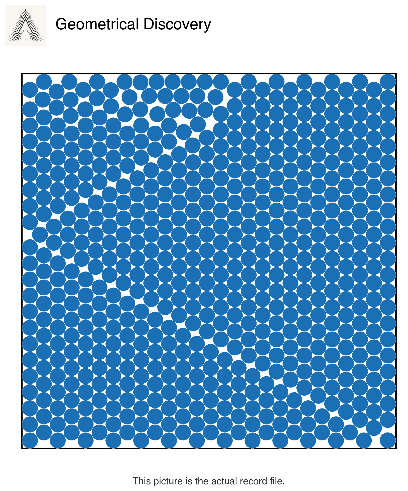

# Aletheia packing candidate records


*This picture is the actual 600-circle record file: every circle at its certified position and size.*

Status: **candidate records, submitted to the catalog maintainer for verification.** They are not accepted records. They do not prove the best possible packings.

## The problem

Fit a fixed number of equal circles inside a square. Every circle must stay inside the square. No two circles can overlap. A larger circle radius means a better layout for that fixed count.

## What Aletheia found

Aletheia produced fixed coordinate files for 600, 700, and 800 circles. A checker that does not round the coordinates tested every wall and every pair of circles. Each file supports a radius just above the value printed in the public Packomania catalog.

| Circles | Supported radius | Radius printed in the catalog |
| ---: | ---: | ---: |
| 600 | 0.02147937677931336792435345333619189507511634335902592795709860126783031076603618257014873085383241024 | 0.021479376754 |
| 700 | 0.01990364285635992080414501095152789833198973658477548808811217087782022076562630386337076619834542754 | 0.019903642828 |
| 800 | 0.01863759233676851787349305044720107162570826540500351479481853408661754556406518746010543808969481480 | 0.018637592286 |

The catalog maintainer received the three candidate files on 2026-08-31. The maintainer has not accepted them. Private, new, or unindexed stronger files can exist.

## Verify all three in one command

Use Python 3. No package install or network access is needed.

```sh
python3 verify.py
```

The command checks the saved file hashes. It then reads each 24-place coordinate as an integer, checks all four walls, checks every pair of circles, and calculates the radius supported by the fixed points. It also checks that the new result matches the two saved check reports.

Run the known-answer failure tests with:

```sh
python3 tests/test_verify.py
```

Those tests prove that the checker rejects a missing circle, two circles at the same point, and a circle that crosses a wall.

## Files

- `data/` has the three coordinate files.
- `checks/` has the three exact-check reports and the three separate check reports from the frozen run.
- `verifier/exact_checker.py` is the byte-for-byte checker used in the run.
- `verify.py` pins the checker and data hashes and verifies the kit in one command.
- `ARTIFACTS.sha256` records the source hashes.

The copied checker came from Project Aletheia's Record Forge II packing run. Checker SHA-256: `0234eb7763dee32c3a1081139fb049978ecda593cf845f19bd4f44d2eaf8d739`.

## Claim limit

The files show that these three fixed layouts fit at the stated radii. They do not show that no better layouts exist. They do not show that no earlier private result exists. Until the catalog maintainer decides, they remain candidate records submitted for verification.

## License

The proposed license uses CC0 1.0 for the coordinate data and saved check reports, and the MIT License for the code. See `LICENSE.md`. The repository owner must approve these terms before public release.
